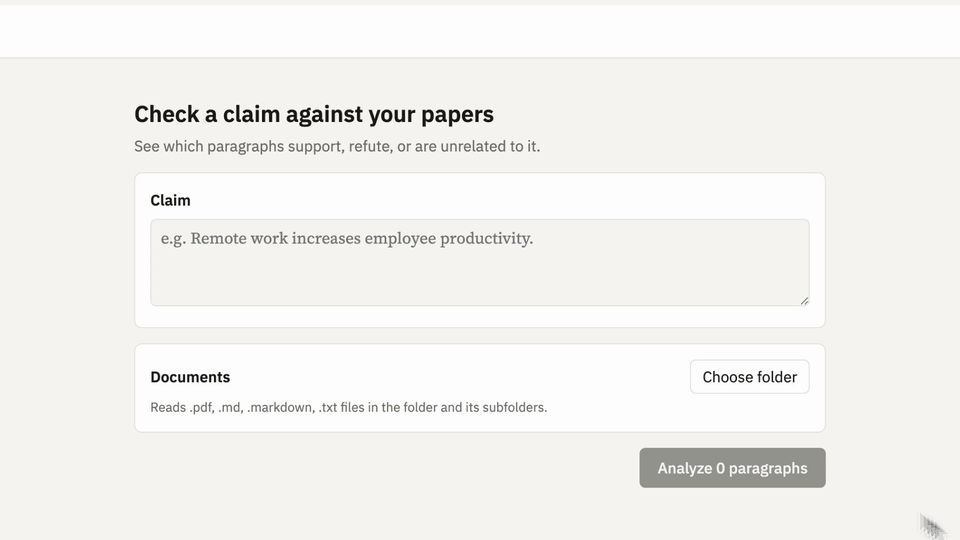

# ref-a-claim

*It finds the references. You're the ref.*

Enter a claim, pick or drop `.pdf`, `.md` or `.txt` files (or folders of them), and read each paper as it
is, with the paragraphs that support or refute the claim tinted in place. A compound claim can be entered as several
claims, one per line, to see which part each paragraph bears on. Each paragraph is classified by TypeSafe's
[Jev](https://docs.typesafe.ai/introduction) model.



Everything runs in the browser; nothing is sent to a server.
See demo at [https://ref-a-claim.vercel.app/](https://ref-a-claim.vercel.app/).

> [!WARNING]
> Results depend largely on the Jev model and on the clarity and complexity of the claim. Every result should be
> re-checked by a human: this tool is first a demo of Jev, meant as a navigator that helps you find related
> paragraphs more easily.

## Settings

The gear button opens Settings: the TypeSafe API key, the model, the maximum paragraph length, how much surrounding context is sent with each paragraph, and the probability from which a paragraph judged unrelated is shown as possibly supporting or refuting a claim. The key is kept in the tab's `sessionStorage`, so it is cleared when the tab closes; the other settings are kept in `localStorage`.

## Run Locally

```sh
pnpm install
pnpm dev
```

## How it works

1. Picked files are read in the browser and split into paragraphs: PDFs by extracting their text
   with pdf.js and grouping its lines into blocks by layout, Markdown by parsing it (GFM) and taking its prose
   blocks (paragraphs, lists, block quotes, tables, footnotes; headings, code and HTML are left out),
   and plain text by splitting it on blank lines. Any paragraph longer than the maximum paragraph
   length is split on sentence boundaries. In a PDF, running headers and footers, the front matter
   before the abstract and the references are left out; short numbered or enlarged blocks are taken
   as headings, which become the heading trail of the paragraphs under them; figure and table labels
   are dropped; and a paragraph cut by a column or page break is joined up again. Each paragraph remembers which text items (and which
   characters of them) it came from: pdf.js text items for PDFs, text and inline code nodes of the
   syntax tree for Markdown, and the file itself for plain text. Changing that length in Settings
   re-reads the loaded documents.
2. **Analyze** sends one Jev request per paragraph, at most 8 at a time. With one claim, the state is
   `{ claim, context, passage }` with a single Choice question (`supports` / `refutes` /
   `unrelated`); with several, it is `{ claim_1, claim_2, …, context, passage }` with one such
   question per claim, each judged against its own claim alone. `context` holds the neighbouring
   paragraphs in the same document (how many is a setting), plus the heading trail; the model reads
   it only to understand `passage`, and the stance is about `passage` alone. Results appear as each
   request finishes.
3. The results show the original document: a PDF as drawn by pdf.js (canvas plus its text layer),
   Markdown rendered as HTML (raw HTML is shown as source, not run; images as their alt text), and
   plain text as written. Each paragraph's characters are wrapped in spans and tinted by stance;
   unrelated paragraphs stay untinted, except that one whose support or refute probability reaches
   the Settings threshold gets a faint tint with a dashed underline as possibly supporting or
   refuting. With several claims, the results show one claim at a time or all combined, where each
   paragraph takes its strongest result. Hovering over a tinted paragraph shows its scores for every
   claim.

To keep a finished (or cancelled / failed) analysis, click **Export results** to download it as JSON, and later
**Open results…** to load that file back into the UI — claim, documents, and results are restored
without re-reading or re-running anything. The file embeds the original files (base64), so it is
about a third larger than the papers themselves.
